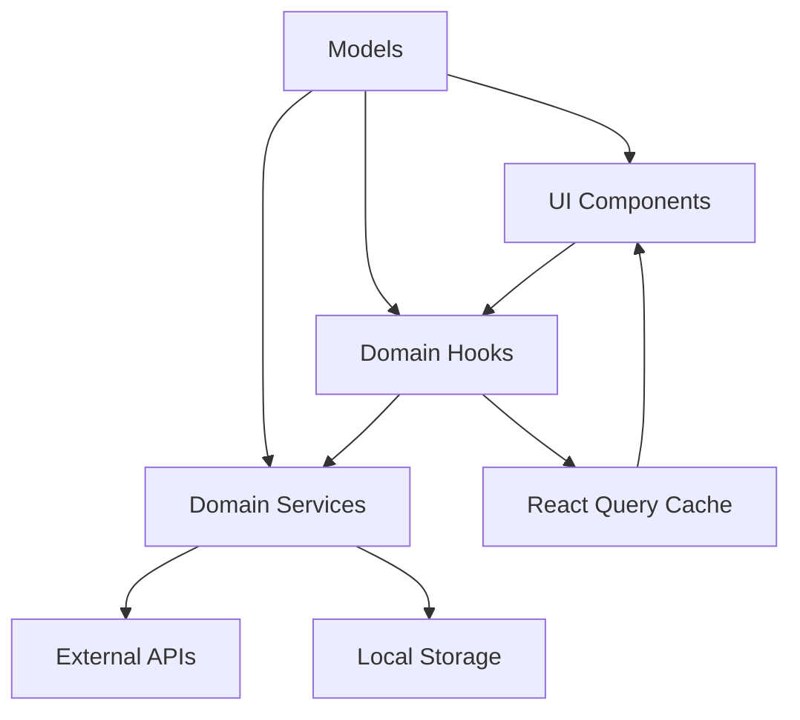

# E-Commerce Frontend Architecture

## Overview

This project follows **Domain-Driven Design (DDD)** principles to create a modular, scalable, and maintainable e-commerce frontend application. The architecture separates business domains while maintaining clean separation of concerns between UI, business logic, and data access layers.

## Architecture Principles

### 1. Domain-Driven Design (DDD)
- **Domain Isolation**: Each business domain is self-contained with its own models, services, and logic
- **Ubiquitous Language**: Consistent terminology used across the codebase that reflects business concepts
- **Bounded Contexts**: Clear boundaries between different business domains
- **Aggregate Roots**: Product, User, Cart, and Authentication serve as aggregate roots

### 2. Clean Architecture
- **Dependency Inversion**: UI components depend on domain services, not external APIs
- **Separation of Concerns**: Business logic is isolated from UI and data access layers
- **Testability**: Pure business logic makes unit testing straightforward

### 3. Modular Structure
- **Domain Modules**: Self-contained modules for each business domain
- **Shared Components**: Reusable UI components and utilities
- **Scalable Organization**: Easy to add new features and domains

## Project Structure

```
src/
├── domains/                    # Business domains (DDD core)
│   ├── authentication/        # Authentication domain
│   │   ├── models/            # Auth entities and value objects
│   │   │   └── Auth.ts        # Login, User, AuthState models
│   │   ├── services/          # Auth business logic
│   │   │   └── AuthService.ts # Login, logout, token management
│   │   └── hooks/             # React hooks for auth state
│   │       └── useAuth.ts     # Authentication state management
│   │
│   ├── products/              # Product catalog domain
│   │   ├── models/            # Product entities and value objects
│   │   │   └── Product.ts     # Product, ProductFilter, ProductSort
│   │   ├── services/          # Product business logic
│   │   │   └── ProductService.ts # CRUD, filtering, sorting
│   │   ├── components/        # Product-specific UI components
│   │   │   ├── ProductCard.tsx
│   │   │   └── ProductGrid.tsx
│   │   └── hooks/             # React hooks for product state
│   │       └── useProducts.ts # Product data management
│   │
│   ├── carts/                 # Shopping cart domain
│   │   ├── models/            # Cart entities and value objects
│   │   │   └── Cart.ts        # Cart, CartItem, CartSummary
│   │   ├── services/          # Cart business logic
│   │   │   └── CartService.ts # Add, remove, update cart items
│   │   └── hooks/             # React hooks for cart state
│   │       └── useCart.ts     # Cart state management
│   │
│   └── users/                 # User management domain
│       ├── models/            # User entities and value objects
│       │   └── User.ts        # User, UserProfile, CreateUserRequest
│       └── services/          # User business logic
│           └── UserService.ts # User CRUD operations
│
├── shared/                    # Shared across domains
│   └── components/            # Reusable UI components
│       └── Layout/            # Layout components
│           └── Header.tsx     # Application header with navigation
│
├── pages/                     # Route-level components
│   ├── HomePage.tsx           # Landing page with featured products
│   ├── ProductsPage.tsx       # Product catalog with filtering
│   ├── LoginPage.tsx          # User authentication
│   └── CartPage.tsx           # Shopping cart management
│
├── components/ui/             # Reusable UI components (shadcn/ui)
├── hooks/                     # Global React hooks
├── lib/                       # Utilities and helpers
└── index.css                  # Design system and global styles
```

## Domain Details

### 1. Authentication Domain
**Responsibility**: User authentication and authorization
- **Models**: LoginCredentials, AuthUser, AuthState
- **Services**: Login, logout, token management, session persistence
- **Key Features**: JWT token handling, demo user credentials, persistent sessions

### 2. Products Domain
**Responsibility**: Product catalog management
- **Models**: Product, ProductFilter, ProductSort
- **Services**: Product CRUD, category management, filtering, sorting
- **Key Features**: Product search, category filtering, price range filtering, sorting

### 3. Carts Domain
**Responsibility**: Shopping cart functionality
- **Models**: Cart, CartItem, CartSummary
- **Services**: Cart state management, item manipulation, persistence
- **Key Features**: Add/remove items, quantity updates, local storage persistence, price calculations

### 4. Users Domain
**Responsibility**: User profile management
- **Models**: User, UserProfile, CreateUserRequest
- **Services**: User CRUD operations, profile management
- **Key Features**: User data management, profile updates

## Data Flow Architecture



### 1. UI Layer (Presentation)
- **React Components**: Pure UI components that display data and handle user interactions
- **Pages**: Route-level components that compose multiple domains
- **Hooks**: Custom React hooks that connect UI to domain logic

### 2. Domain Layer (Business Logic)
- **Services**: Contain all business logic and API interactions
- **Models**: Define data structures and business entities
- **Hooks**: React-specific adapters for domain services

### 3. Data Layer
- **External APIs**: FakeStore API for product, user, and cart data
- **Local Storage**: Cart persistence and authentication tokens
- **React Query**: Caching and data synchronization

## Key Design Patterns

### 1. Service Pattern
Each domain has a service class that encapsulates business logic:
```typescript
class ProductService {
  async getAllProducts(): Promise<Product[]> { /* ... */ }
  filterProducts(products: Product[], filter: ProductFilter): Product[] { /* ... */ }
  sortProducts(products: Product[], sortBy: string): Product[] { /* ... */ }
}
```

### 2. Repository Pattern (Implicit)
Services act as repositories, abstracting data access:
- API calls for server data
- LocalStorage for client-side persistence
- React Query for caching

### 3. Hook Pattern
Custom hooks provide React-specific interfaces to domain services:
```typescript
export const useProducts = () => {
  const { data: products, isLoading } = useQuery({
    queryKey: ['products'],
    queryFn: () => productService.getAllProducts()
  });
  return { products, isLoading };
};
```

### 4. Observer Pattern
React's state management naturally implements observer pattern:
- Components subscribe to state changes
- Services notify of state updates
- Automatic re-rendering on data changes

## Technology Stack

### Frontend Framework
- **React 18**: Component-based UI library
- **TypeScript**: Type-safe development
- **Vite**: Fast build tool and development server

### State Management
- **React Query**: Server state management and caching
- **React Hooks**: Local component state
- **Local Storage**: Client-side persistence

### Styling
- **Tailwind CSS**: Utility-first CSS framework
- **shadcn/ui**: Pre-built accessible components
- **Custom Design System**: Consistent visual language

### Routing
- **React Router**: Client-side routing
- **URL State**: Filter and search parameters in URL

## Design System

The application uses a comprehensive design system defined in `index.css`:

### Color Palette
- **Primary**: Modern indigo (`hsl(225 83% 53%)`)
- **Accent**: Vibrant orange (`hsl(25 95% 53%)`)
- **Secondary**: Warm slate tones
- **Surface**: Light backgrounds with subtle gradients

### Components
- **Cards**: Subtle shadows with gradient backgrounds
- **Buttons**: Gradient animations and hover effects
- **Inputs**: Blur effects and focus states
- **Navigation**: Backdrop blur with transparency

### Responsive Design
- **Mobile-first**: Design starts with mobile and scales up
- **Breakpoints**: Standard Tailwind breakpoints (sm, md, lg, xl)
- **Adaptive Layouts**: Flexbox and Grid for responsive layouts

## API Integration

### FakeStore API
- **Base URL**: `https://fakestoreapi.com`
- **Endpoints**: Products, Users, Carts, Authentication
- **Features**: CRUD operations, category filtering, authentication

### Error Handling
- Service-level error catching and logging
- User-friendly error messages via toast notifications
- Graceful degradation for API failures

### Caching Strategy
- React Query for server state caching
- 5-minute stale time for products
- 10-minute stale time for categories
- Manual cache invalidation on mutations

## Security Considerations

### Authentication
- JWT token storage in localStorage
- Token validation on protected routes
- Automatic logout on token expiration

### Data Validation
- TypeScript interfaces for type safety
- Input validation on forms
- Sanitization of user inputs

## Performance Optimizations

### Code Splitting
- Lazy loading of route components
- Dynamic imports for heavy dependencies

### Image Optimization
- Lazy loading of product images
- Optimized image sizing and formats

### Caching
- React Query for API response caching
- LocalStorage for cart persistence
- Browser caching for static assets

## Testing Strategy

### Unit Tests
- Domain services with pure business logic
- Utility functions and helpers
- Model validation logic

### Integration Tests
- API service integration
- Component interaction with services
- End-to-end user workflows

### Tools
- Jest for unit testing
- React Testing Library for component testing
- MSW for API mocking

## Deployment

### Build Process
- Vite production build
- TypeScript compilation
- CSS optimization and purging
- Asset bundling and optimization

### Environment Configuration
- Environment variables for API endpoints
- Build-time configuration
- Runtime feature flags

## Future Enhancements

### Scalability
- Micro-frontend architecture for large teams
- Module federation for independent deployments
- Domain-specific routing and lazy loading

### Features
- Real-time notifications
- Advanced search with Elasticsearch
- Recommendation engine
- Multi-language support
- Payment integration

### Performance
- Server-side rendering (SSR)
- Progressive Web App (PWA) features
- Advanced caching strategies
- CDN integration

## Development Guidelines

### Code Organization
1. Keep domain logic separate from UI components
2. Use TypeScript interfaces for all data structures
3. Implement error boundaries for graceful error handling
4. Follow consistent naming conventions

### Best Practices
1. Single Responsibility Principle for services and components
2. Dependency injection through React context when needed
3. Immutable state updates
4. Comprehensive error handling and logging

### Code Quality
1. ESLint and Prettier for code formatting
2. TypeScript strict mode for type safety
3. Consistent component and file naming
4. Comprehensive JSDoc comments for complex logic

This architecture provides a solid foundation for building scalable e-commerce applications while maintaining clean separation of concerns and following domain-driven design principles.